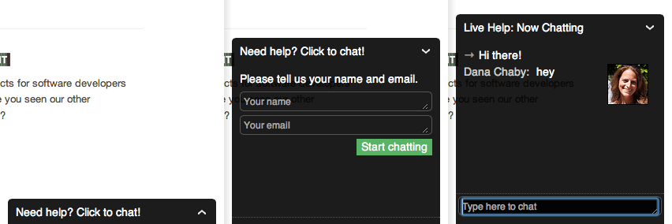

Dark theme for Olark
====================

Custom CSS to prettify Olark's dark theme (glass2).

The default glass2 theme:

The new theme:

See live examples on [Beanstalk](http://beanstalkapp.com) and [Postmark](https://postmarkapp.com/).

Installation is easy - choose glass2 theme, set Olark settings and theme variables to the same values and include Sass file to your project. You can copy and paste generated CSS and adjust settings manually, too.

As you're going to overwrite Olark's styles they can't guarantee that everything will work propertly. I'll try to keep this theme as up to date as possible, but there is no guarantee that it won't be broken with a next Olark's update. You can read more about Olark customization on [their help site](https://www.olark.com/help/css).

Settings and variables
----------------------

You can change settings on Settings > Appearance page in Olark and in Sass variables (ex. olark-dark-and-green.scss).

1. Set "Submit button background" and `$accent-color` variable to the same color.
2. Set Width in "Olark Box Size and Location" and `$o-width` to the same value.
3. Set "Olark link" to "No Branding". (Requires whitelisted plan.)

Operator avatars
----------------

The new theme supports operator avatars. [Learn how to add them.](http://www.olark.com/customer/portal/articles/341508-operator-avatars)
